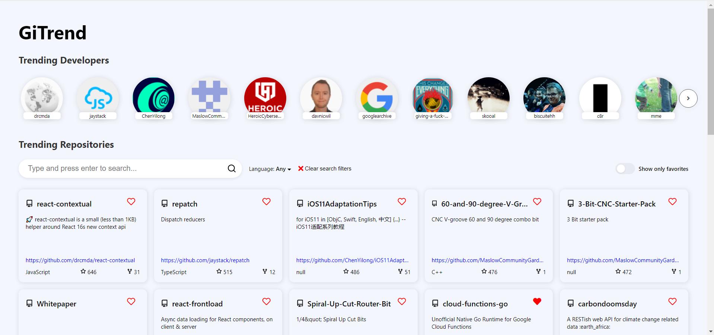
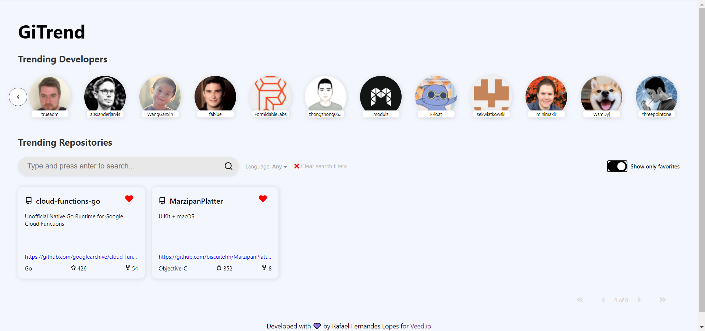
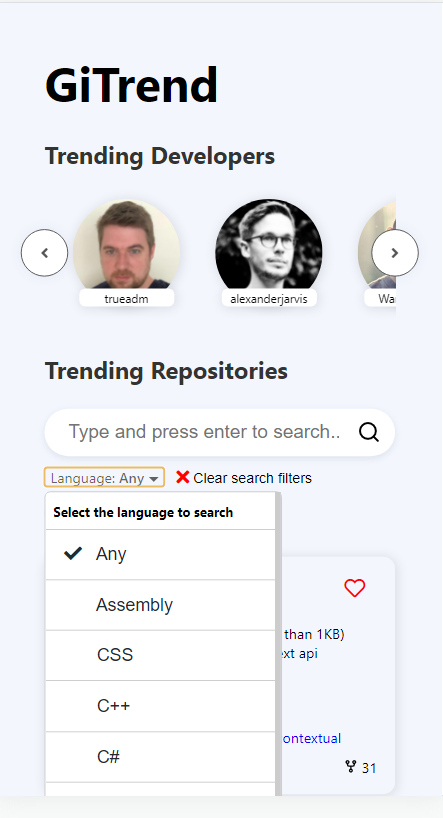
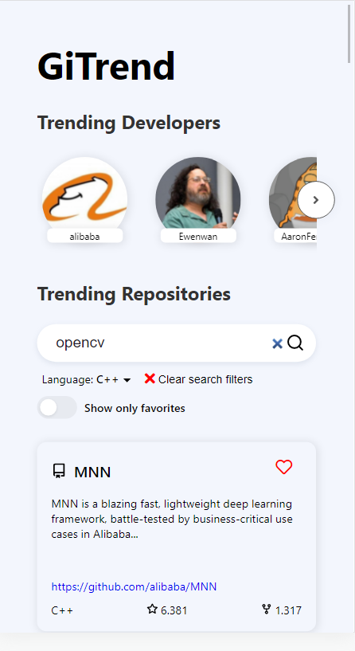

# GiTrend


## About

<p align="center">Project which allows the search for trending repositories in GitHub
</p>


## Table of Contents
=================

   * [About](#about)
   * [Table of Contents](#table-of-contents)
   * [Project Description](#-project-description)
   * [Prerequisites](#-prerequisites)
   * [Installation](#-installation)
   * [Technologies](#-technologies)
   * [Author](#-author)

---

## 💻 Project Description

The project was developed to allow the search of trending repositories in GitHub. It was structured to show the configuration of a [React.js](https://reactjs.org/) project using [Husky](https://typicode.github.io/husky/#/), [lint-staged](https://github.com/okonet/lint-staged), [eslint](https://eslint.org/), [prettier](https://prettier.io/) and [commitlint](https://commitlint.js.org/#/) with [conventional commits](conventionalcommits.org/). The project also shows how to implement unit and integration tests with [React Testing Library](https://testing-library.com/). [Redux](https://redux.js.org/) was used as state manager with [Redux Toolkit](https://redux-toolkit.js.org/) and [Redux Thunk](https://github.com/reduxjs/redux-thunk) for implementing asynchronous communication middlewares in order to consume the [GitHub API](https://docs.github.com/en/rest).

### Screenshots:

<table>
  <tr>
    <td>Main screen</td>
    <td>Main screen with the favorites filter activated</td>
  </tr>
  <tr>
    <td></td>
    <td></td>
  </tr>
  <tr>
    <td>Responsive main screen with language menu</td>
    <td>Responsive main screen with text search</td>
  </tr>
  <tr>
    <td></td>
    <td></td>
  </tr>
 </table>

---

<a name="prerequisites"></a>
## ⚙️ Prerequisites

Before starting, you need [Node.js](https://nodejs.org/en/), [Yarn](https://yarnpkg.com/) and [Git](https://git-scm.com/) installed and configured.

```bash
# Clone this repository
$ git clone https://github.com/rafaelfl/gitrend

# Enter in the project folder in terminal/cmd
$ cd gitrend
```

## 🚀 Installation

After installing the tools and the source code, you can install the dependencies and run the project.

```bash
# Install dependencies
$ yarn install

# Run the project using the following syntax
$ yarn start
```

The application will be available on `http://localhost:3000`.

Some interesting commands:

- `yarn build` - build the page for deploying
- `yarn test` - run the unit and integration tests
- `yarn test:cov` - run the tests and show the coverage report
- `yarn lint` - run the linter to identify some problems in code
- `yarn lint:fix` - run the linter to identify and fix problems in code
- `yarn prettier` - run the prettier formatter

Furthermore, the Husky is configured to verify commit messages incompatible with the "Conventional Commits" standard, as well as to run the linter and prettier in the code.

---

## 🛠 Technologies

- [TypeScript](https://www.typescriptlang.org)
- [React.js](https://reactjs.org/docs/getting-started.html)
- [Yarn](https://yarnpkg.com)
- [Redux Toolkit](https://redux-toolkit.js.org/)
- [Redux Thunk](https://github.com/reduxjs/redux-thunk)
- [React Testing Library](https://testing-library.com/)
- [Mock Service Worker](https://mswjs.io/)
- [Husky](https://typicode.github.io/husky/#/)
- [eslint](https://eslint.org/)
- [lint-staged](https://github.com/okonet/lint-staged)
- [prettier](https://prettier.io/)
- [commitlint](https://commitlint.js.org/#/)

---

## 🦸 Author

<a href="https://github.com/rafaelfl/">
 
 <br />
 <sub><b>Rafael Fernandes Lopes</b></sub></a>


Developed with 💜 by Rafael Fernandes Lopes

[](https://www.linkedin.com/in/rafael-fernandes-lopes/)
